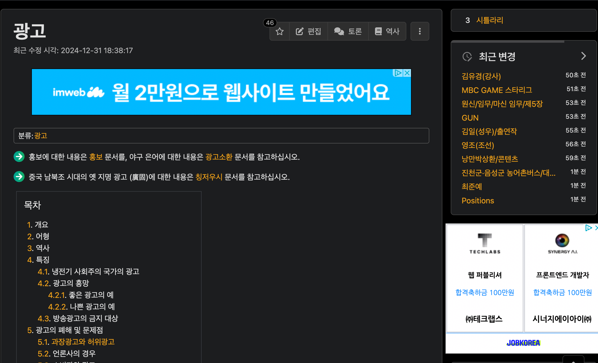
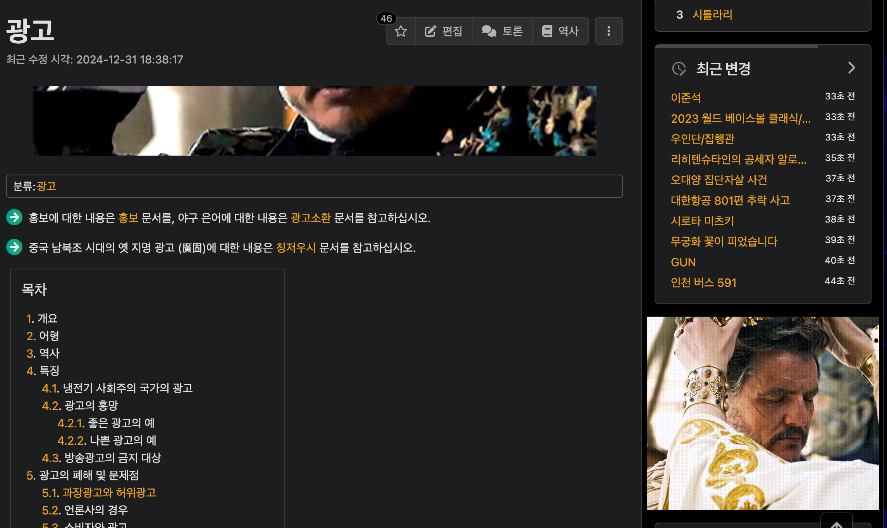

# Ad to Pedro (광고를 페드로로!)

  

[English](README_EN.md) | Korean

## 주요 기능
- 웹페이지의 광고를 페드로 파스칼의 재미있는 움짤로 자동 변경
- 작은 광고는 30초마다 다른 페드로 이미지로 자동 교체
- 가볍고 빠른 동작

## 설치 방법
1. 이 저장소를 다운로드
2. Chrome에서 `chrome://extensions` 접속
3. '개발자 모드' 켜기
4. '압축해제된 확장프로그램을 로드합니다' 클릭
5. 다운로드 받은 폴더 선택

## 스크린샷
| 변경 전 | 변경 후 |
|---------|---------|
|  |  |

## 사용 방법
- 설치 후 자동으로 작동합니다
- 큰 광고의 경우 우측 상단 X 버튼으로 제거 가능
- 새로고침 시 새로운 페드로 이미지로 변경

## 기여하기
PR과 이슈는 언제나 환영합니다!

## ⭐ 이런 분들께 추천
- 지루한 광고 대신 페드로를 보고 싶으신 분
- The Last of Us, Mandalorian 팬
- 웹서핑을 재미있게 하고 싶으신 분

## 📝 라이선스
MIT License