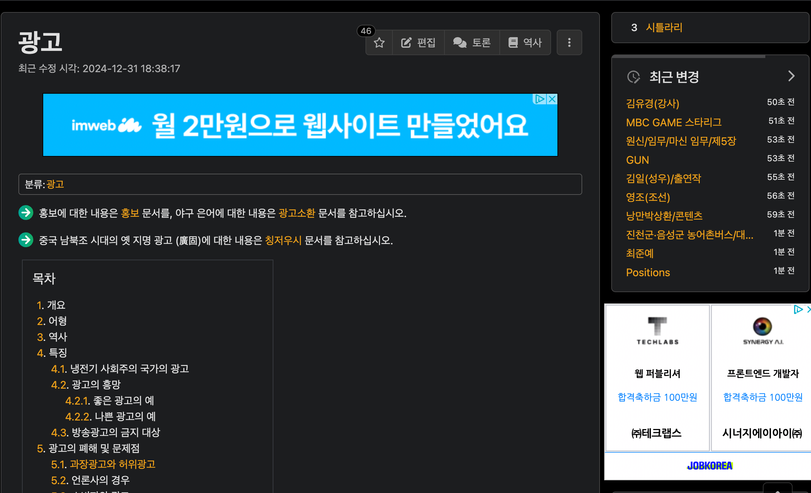
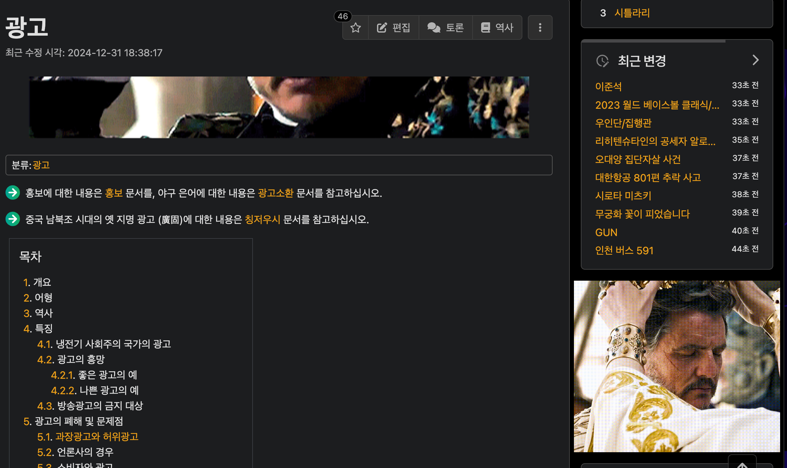

# Ad to Pedro

  

English | [Korean](README.md)

## Features
- Automatically replaces web ads with fun Pedro Pascal GIFs
- Small ads automatically change to different Pedro images every 30 seconds
- Light and fast performance

## Installation
1. Download this repository
2. Go to `chrome://extensions` in Chrome
3. Enable 'Developer mode'
4. Click 'Load unpacked'
5. Select the downloaded folder

## Screenshots
| Before | After |
|--------|-------|
|  |  |

## How to Use
- Works automatically after installation
- Large ads can be removed using the X button in the top right corner
- Images change to new Pedro GIFs on page refresh

## Contributing
PRs and issues are always welcome!

## Recommended For
- Anyone who wants to see Pedro instead of boring ads
- Fans of The Last of Us and The Mandalorian
- People who want to make web surfing more fun

## License
MIT License 